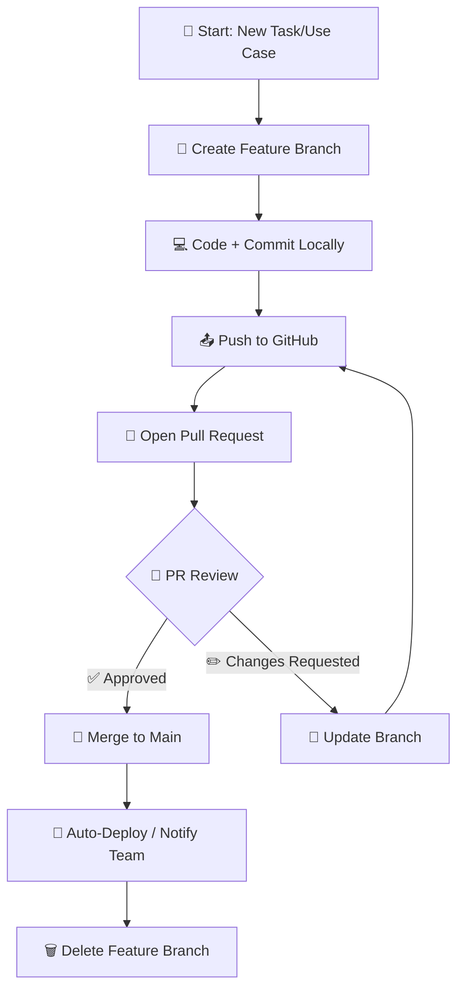

```mermaid
flowchart TD
    A[🎯 Start: New Task/Use Case] --> B[🔀 Create Feature Branch]
    B --> C[💻 Code + Commit Locally]
    C --> D[📤 Push to GitHub]
    D --> E[🔁 Open Pull Request]
    
    E --> F{👥 PR Review}
    F -->|✅ Approved| G[🔀 Merge to Main]
    F -->|✏️ Changes Requested| H[🔧 Update Branch]
    H --> D
    
    G --> I[🚀 Auto-Deploy / Notify Team]
    I --> J[🗑️ Delete Feature Branch]
    
```